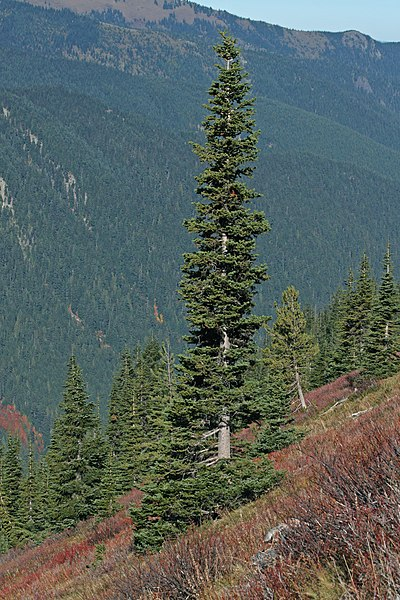

# 時系列統計データストアとしての `seichi-timed-stats-conifers`

## 文脈

(TODO: SeichiRanking の現状を説明する)

ランキングシステムは、「プレーヤーデータの(整地鯖システム内での)公開」、「過去のプレーヤーデータの蓄積とアクセス」及び「ランキング情報の計算とそのキャッシュの保持」の三つの機能を組み合わせて初めてバックエンドの機能が実現できる。

新システムの設計においては、これら三つの機能は独立した機能だと考え、各々をマイクロサービスのコンポーネントとして実装することにした。本ドキュメントの関心の対象である `seichi-timed-stats-conifers` は、「過去のプレーヤーデータの蓄積とアクセス」を実現するシステムとして設計する。

## 目標

### 実現すべきこと (Goals)

#### 機能要件

- 全プレーヤーの各種統計(とりあえずは整地量、建築量、プレイティック数、投票数)を、統計量を読み取った正確なタイミングとともに蓄積することができる
- 任意に与えられた時刻について、その時刻の直前に蓄積された全プレーヤーの統計量データを読み出すことができる

#### 非機能要件

- 過去の統計量データの読み出しは 1 秒程度で完了するのが望ましい
- データの蓄積に使う形式は、ディスク使用量が少ないものであることが望ましい

### 実現しないこと (non-Goals)

- ランキング情報の生成。これは、 `seichi-timed-stats-conifers` に対して API 呼び出しを行うような別コンポーネントにて実装する。

## 用語の定義

以下、統計 `S` (例えば、整地量、建築量など) について、特定時刻での全プレーヤーの `S` の値の集まりのことを **S に関する統計量スナップショット** と呼ぶことにする。統計 `S` が文脈から明らか、又は重要でない場合は、これを省略して単に **統計量スナップショット** と呼ぶことにする。

## どのように実現するか

### データの永続化方法について

RDB を用いてデータを永続化する。

ディスク使用量を少なくし、読み出しをそれなりに高速にするため、

- 定期的に統計量スナップショットを保存する
- 5分といった短い期間ごとに、全プレーヤーの統計量をゲームデータサーバーから読み出し、前回の統計量記録からの差分があったデータとの差分を確認したうえで、差分を記録する
  - FIXME: ここの「差分」という用語は非常に分かりずらい。numeric な difference なのか、 git 的な diff なのかを説明する必要があって、 @kory33 の意図としては後者。
  - この時一度に記録する差分データの事を **統計量差分** と呼ぶことにする。
    - 統計量差分は、別の統計量差分または統計量スナップショットを基底 (base) とし、基底からの差分データを保持している
      - 統計量差分 `d` について、差分の基底となる統計量差分または統計量スナップショットを `base(d)` と書くことにする。
    - 時刻 A の統計量スナップショットに、時刻 A のスナップショットを基底とする時刻 B の統計量差分を適用することで、時刻 B の統計量スナップショットを得ることができる

という方式を取る。

---

データベース D について、次のような有向グラフ G\_D = (V\_D, E\_D) を考える。
- V\_D = D の 差分データと統計量スナップショットの集合
- E\_D = `{ (base(d), d) | d は D の差分データ }`

データ不整合をなるべく防ぐという観点から、データベース D 全体に仮定する不変量は

- G\_D が有向森となる
- E\_D の辺 `(s, t)` について、 `s` の時刻は `t` の時刻未満となる

**のみ** とする。つまり、差分データの枝分かれがあっても良いし、差分データが必ず直前の差分データや統計量スナップショットを基底とするとは限らない。

## 検討した代替案 (Alternatives Considered)

### 差分データにて統計量の数値差分ではなく絶対値を持ちまわしている理由

(プレーヤーの統計量の時系列を取るのが一クエリでできるから、というのを書く)

### データの永続化に利用するミドルウェア

(TSDBを検討したが、 large series cardinality 問題により採用しなかった理由を述べる)

### データの永続化手法について

(深さ高々2の形の木や skiplist 的な構造なども検討したが、複雑性やデータ使用量の都合から採用しなかった旨を述べる)

## 備考

### 名前の由来について

[どのように実現するか](#どのように実現するか) の節で説明したように、 `seichi-timed-stats-conifers` は「大きな枝分かれが基本的に発生しないような、親ノードとの差分を記録する木構造の集まり」にて時系列上の統計量データを記録する。

(グラフ理論的な)木の集まりは(グラフ理論的な)森と呼ばれており、「枝分かれが少ない木の集合」を @kory33 が「針葉樹林みたいだなぁ」と思ったことから、 `conifers` という名前を付けることになった。

[Abies lasiocarpa 5922](https://commons.wikimedia.org/wiki/File:Abies_lasiocarpa_5922.JPG), by Walter Siegmund.

